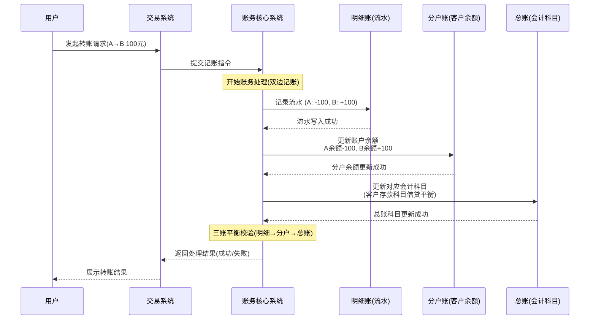

```mermaid
sequenceDiagram
    participant U as 用户
    participant TS as 交易系统
    participant AS as 账务核心系统
    participant DL as 明细账(流水)
    participant SL as 分户账(客户余额)
    participant GL as 总账(会计科目)

    U->>TS: 发起转账请求(A→B 100元)
    TS->>AS: 提交记账指令

    note over AS: 开始账务处理(双边记账)

    AS->>DL: 记录流水 (A: -100, B: +100)
    DL-->>AS: 流水写入成功

    AS->>SL: 更新账户余额<br/>A余额-100, B余额+100
    SL-->>AS: 分户余额更新成功

    AS->>GL: 更新对应会计科目<br/>(客户存款科目借贷平衡)
    GL-->>AS: 总账科目更新成功

    note over AS: 三账平衡校验(明细→分户→总账)

    AS-->>TS: 返回处理结果(成功/失败)
    TS-->>U: 展示转账结果
```
